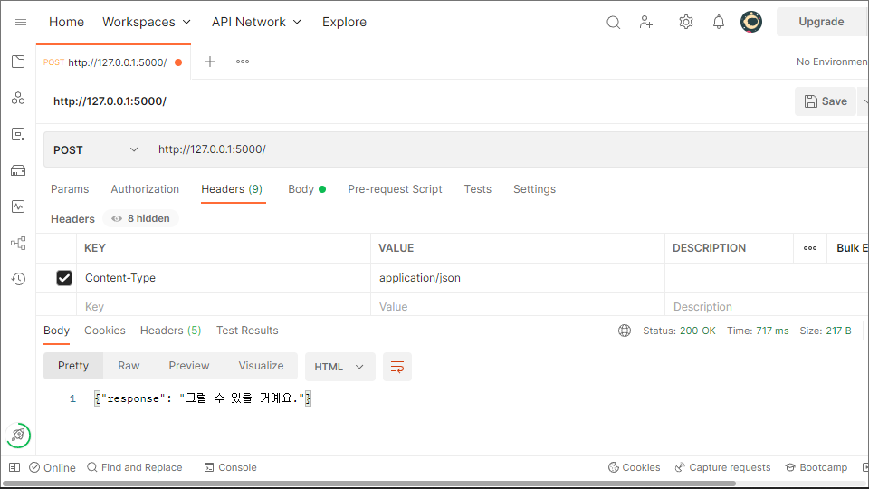
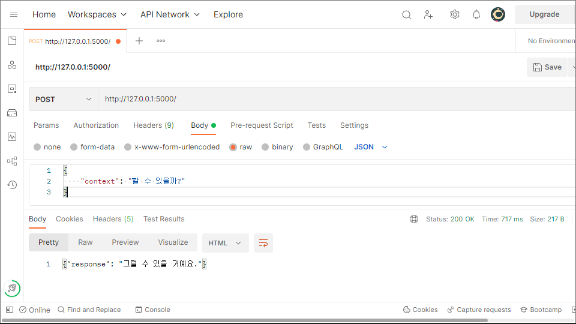

# backend-api-for-chatbot-with-Poly-Encoder

### Desclaimer
This is a post work of my retrieval-based-chatbot-with-Poly-Encoder project.  
All the modules needed for the DB connection and backend api are organized.  

It runs ok on my labtop with cpu(AMD 5500U).  

I hope that someone finds this repo useful.  
Send me a message if anyone has to ask about the project. 


### Related repositories
[Poly-Encoder](https://github.com/dotsnangles/Poly-Encoder)  
[retrieval-based-chatbot-with-Poly-Encoder](https://github.com/dotsnangles/retrieval-based-chatbot-with-Poly-Encoder)

### Download the files for demo
```bash
python download.py
```

### Set DB
Ubuntu 20.04.4 LTS on WSL
```bash
sudo apt install mysql-server
sudo service mysql start
sudo service mysql status
sudo mysql -u root -p
```
```mysql
mysql> CREATE USER 'user'@'localhost' IDENTIFIED BY 'password';
mysql> GRANT ALL ON *.* TO 'user'@'localhost' WITH GRANT OPTION;
mysql> CREATE DATABASE chatbot;
```

### Run
```bash
python api.py
```

### Test with Postman



### On Colab

[Link](https://github.com/dotsnangles/chatbot-rest-api/blob/master/on_colab.ipynb)
